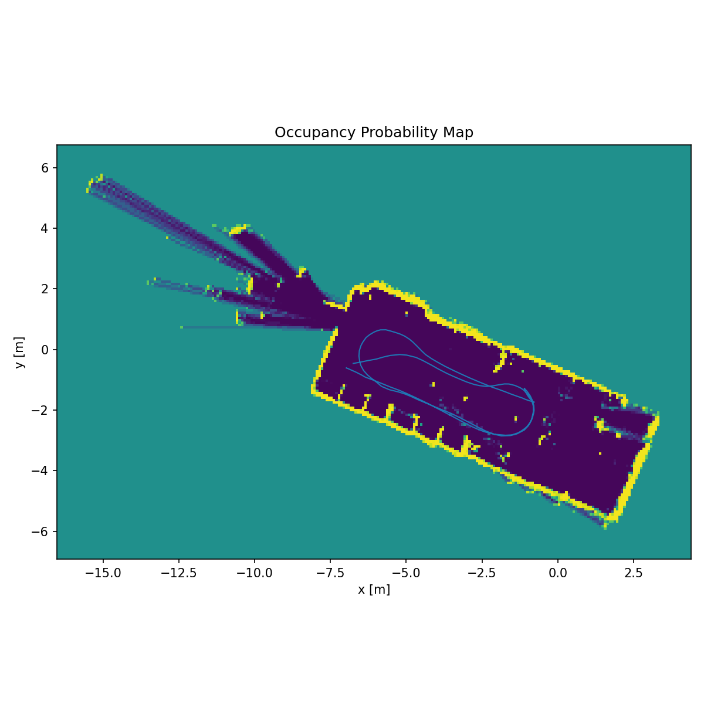
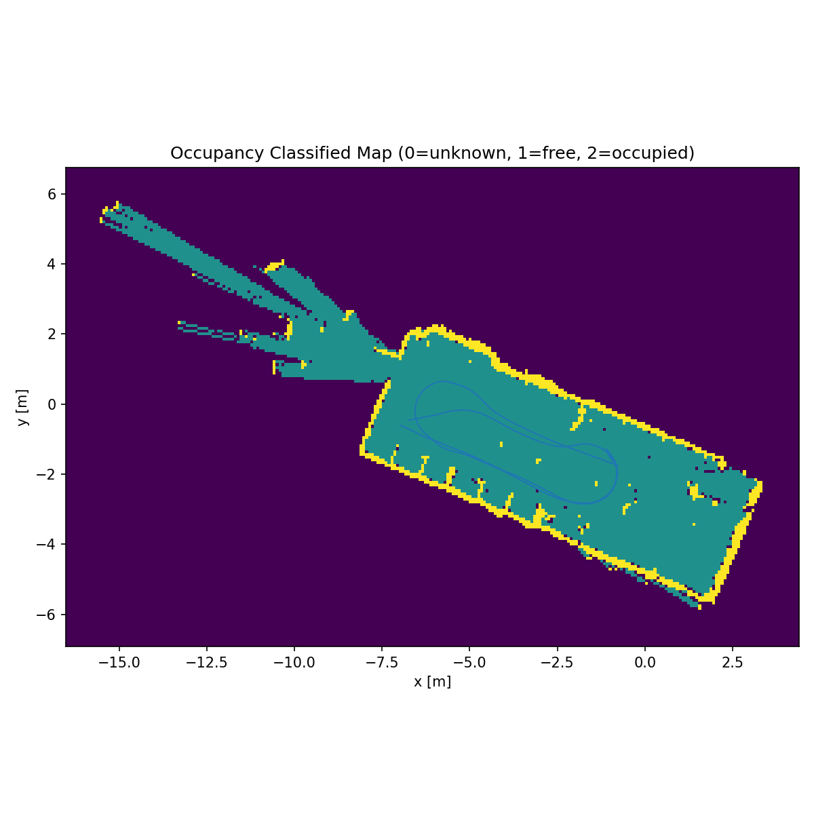

# Occupancy Grid 2D da dati LiDAR e ZED

Questo progetto realizza una pipeline offline per costruire una **occupancy grid 2D** a partire da dati reali acquisiti da un rover dotato di **LiDAR 2D** e camera **ZED**.

La pipeline legge bag ROS2, sincronizza le scansioni LiDAR con l'odometria ZED, ricostruisce i raggi nel frame globale e aggiorna una mappa probabilistica tramite log-odds.

---

## Pipeline

La pipeline è composta da tre fasi principali:

1. **Preprocessing**
   - lettura dei topic `/scan` e `/zed/zed_node/odom`;
   - gestione dei timestamp `bag_time` e `header_time`;
   - interpolazione della posa ZED;
   - trasformazione approssimata ZED--LiDAR;
   - conversione dei raggi LiDAR in punti locali e globali.

2. **Mapping**
   - costruzione della griglia 2D;
   - ray tracing con Bresenham;
   - aggiornamento delle celle libere e occupate in log-odds;
   - generazione della mappa probabilistica e della mappa classificata.

3. **Debug ed explainability**
   - visualizzazione delle mappe;
   - viewer step-by-step;
   - analisi dei raggi validi, dei raggi a zero e dei raggi oltre soglia.

---

## Demo viewer

La viewer permette di osservare l'evoluzione della mappa scan dopo scan, confrontando:

- la **mappa cumulativa** aggiornata progressivamente;
- la **mappa del singolo scan**;
- la distribuzione dei **raggi LiDAR** dello scan corrente.

[Guarda la demo della viewer](media/viewer_demo.mp4)

---

## Esempio di risultato

### Mappa probabilistica



### Mappa classificata


---

## File principali

- `preprocess_bag.py`: legge il bag ROS2, estrae odometria e scan, sincronizza i dati e ricostruisce i punti LiDAR.
- `build_occupancy_grid.py`: costruisce la occupancy grid 2D usando log-odds, Bresenham e classificazione finale.
- `run_test_mapping.py`: script principale per lanciare un esperimento completo.
- `zero_ray_explainability_viewer_v2.py`: genera una viewer step-by-step per analizzare raggi validi, raggi a zero e raggi oltre soglia.
- `occupancy_grid_Poggesi_AARI.pdf`: report completo del progetto.

---

## Dati ROS2 bag di esempio

Per rendere il progetto riproducibile sono state aggiunte alcune registrazioni ROS2 bag di esempio nella cartella:

```text
bag_data_example/
```

La struttura prevista è:

```text
bag_data_example/
└── rosbag2_2024_12_03-14_25_05/
    ├── metadata.yaml
    └── rosbag2_2024_12_03-14_25_05_0.db3
```

Ogni sottocartella contiene:

- `metadata.yaml`: metadati della registrazione ROS2;
- file `.db3`: database SQLite con i messaggi registrati.


---

## Esecuzione

Aggiornare il percorso del bag in `run_test_mapping.py`:

```python
BAG_PATH = r"bag_data_example/rosbag2_2024_12_03-14_25_05"
```

Poi eseguire:

```bash
python run_test_mapping.py
```

Per generare la viewer di explainability:

```bash
python zero_ray_explainability_viewer_v2.py "bag_data_example/rosbag2_2024_12_03-14_25_05"
```

---

## Output

Ogni esperimento salva i risultati in una cartella dedicata dentro `results/`.

Output principali:

- `occupancy_probability.png`: mappa probabilistica;
- `occupancy_classified.png`: mappa classificata;
- `log_odds.npy`: griglia interna in log-odds;
- `probability_grid.npy`: griglia probabilistica;
- `classified_grid.npy`: griglia classificata;
- `occupancy_grid_metadata.json`: parametri e riepilogo numerico;
- `viewer.html`: viewer interattiva per l'analisi step-by-step.

---

## Report completo

Il report completo del progetto è disponibile nel file:

```text
occupancy_grid_Poggesi_AARI.pdf
```
